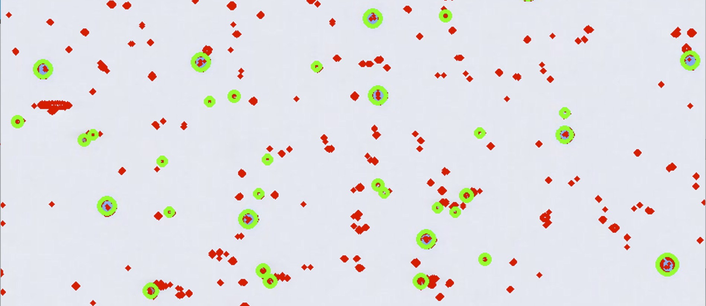
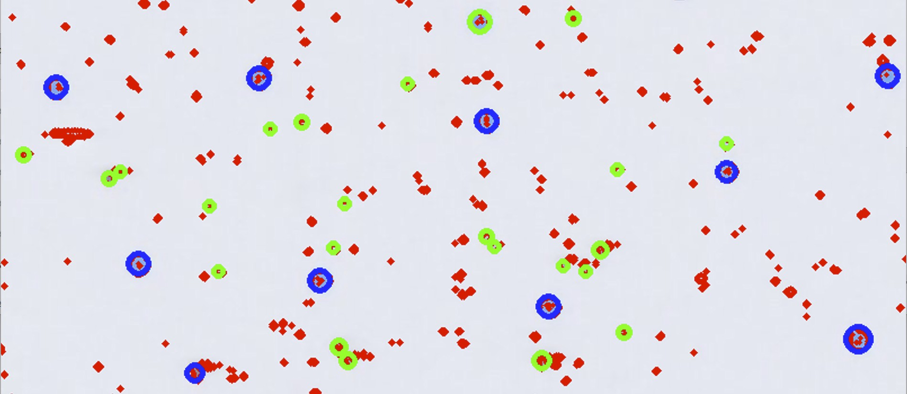
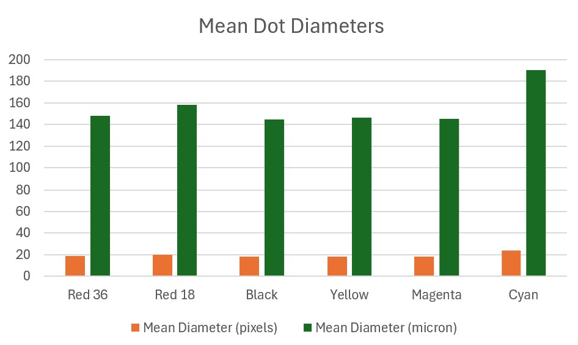

# Image Analysis for Fortune 100 Company

!!! abstract "Case Study Summary"
       
    **Impact Metrics**:
    
    - Saved over $33,000/year in labor costs
    - Successfully identified that one of the inks wetted out more and needed to be replaced

A Fortune 100 company needed help analyzing dot sizes to determine the quality of inks for an inkjet printer.

## Challenge

Inkjet printers work by spitting droplets of ink at very precise speeds and times. One of the factors that can significantly affect the quality of a print is wetting, or how much the ink spreads out after it lands on the target surface. Since wetting is dependent both on the surface tension of the ink and the surface energy of the substrate, the best way to test wetting is to print individual droplets onto a surface and measure their diameter. This has to be done with each ink that one wants to use; in this case, there were 6 colors.

The challenge that is faced with this method is that individual droplets are very hard to measure manually and most software designed to measure small sized droplets will measure one droplet at a time. This will become arduous if one has a sufficient sample size to measure. In addition, at ~150 microns in diameter, ink droplets can be mistaken for dust and vice versa.

## My Approach

Since this particular problem involved 6 different colors printed onto a test strip, the first step was to separate the colors from each other. The colors were printed in even rectangles along the length of the strip with a black rectangle bounding the entire strip. The program’s cropping function used OpenCV Python library to draw all contours in the image. It then found the contour that fit the area requirements and divided the length of that into 6 rectangles, each pertaining to one of the colors. A 20% margin was engineered into each of the sections to make sure there was no overlap.

The logic for determining the dot sizes involved finding the contours again and again, only including contours with a reasonable area size (a reasonable size for a droplet to be). Then, bounding circles were drawn around all of the remaining contours, provided that those circles were within a certain range.

This is where I ran into a problem where certain dust particles or scratch marks were getting picked up and skewing the data. To get around this, I wrote an algorithm that I will call the “Smaller Neighbor” Algorithm. This algorithm involved focusing on a circle and finding all the circles within a certain radius. It would then compare this circle’s size to the next closest, and delete the smaller circle. It would continue focusing on that circle until it either encountered a larger circle (causing the focused one to be removed), or there were no longer any circles remaining within the predefined radius around the focused circle. This algorithm took advantage of the fact that the droplets were mostly evenly spaced and succeeded in making sure that none of the dust or scratches got counted as droplets when determining the mean diameters.

The mean diameters for each color were populated into a spreadsheet along with images of the circles drawn.

## Results & Impact

This program reduced a task that would have taken weeks to mere minutes, saving over $33,000 per year in labor costs. The program was successful in discovering that the cyan ink wetted out more than the other inks, leading the company to go with a different ink.  Despite the analysis of large image files, we were able to process hundreds of test strips by running the program on a laptop.

## Visuals
<figure markdown="span" style="width: fit-content;">
  {: style="transform: scale(0.8); transform-origin: center; margin-bottom: -3rem;"}
  <figcaption style="text-align: left center;">Dots Selected by Filtering</figcaption>
  {: style="transform: scale(0.8); transform-origin: center; margin-bottom: -3rem;"}
  <figcaption style="text-align: left center;">Dots Selected After "Smaller Neighbor" Algorithm</figcaption>
</figure>

<figure markdown="span">
  {: style="transform: scale(0.8); transform-origin: center; margin-bottom: -3rem;"}
  <figcaption>Mean Dot Diameters</figcaption>
</figure>

## Tech Stack

- Python backend services
- OpenCV library

## Additional Context

- Timeline: 3 months
- Team Size: 2 people
- Role: R&D Engineer
- Specialization in Image Analysis

-   :material-coffee:{ .lg .middle } Let's have a virtual coffee together!

    ---
    
    Want to see if we're a match? Let's have a chat and find out. Schedule a free 30-minute strategy session to discuss your AI challenges and explore how we can work together.

    [Book Free Intro Call :material-arrow-top-right:](https://calendly.com/joesamara/introductory-call){ .md-button .md-button--primary }

